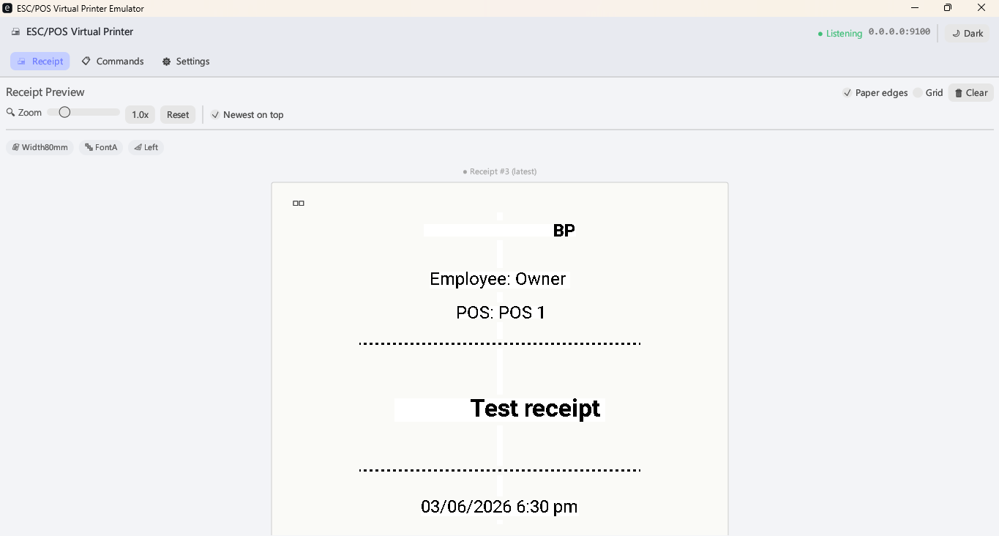
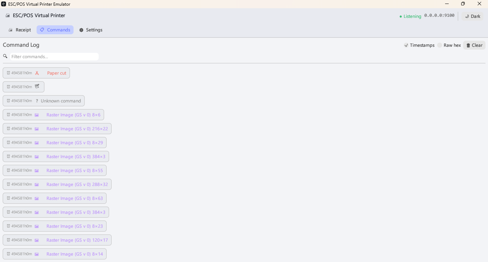

<div align="center">

# 🖨️ ESC/POS Printer Emulator

**A cross-platform virtual ESC/POS thermal receipt printer emulator, built in Rust.**

Turn any computer into a virtual receipt printer to **test, preview and debug POS applications** — no physical thermal printer required.

[](https://www.rust-lang.org/)
[](https://opensource.org/licenses/MIT)
[](https://github.com/digambar9354/escpos-printer-emulator)

</div>

Point your POS / receipt software at this emulator over the network (TCP port `9100`) and watch every receipt render **live** on screen — text, formatting, logos and raster images included.

<div align="center">
  
  
</div>

> 📷 **Screenshots not showing?** Add your own PNGs to [`docs/screenshots/`](docs/screenshots/) — see [Updating the screenshots](#-updating-the-screenshots).

---

## 📑 Table of Contents

- [Features](#-features)
- [Quick Start](#-quick-start)
- [Connecting a POS App](#-connecting-a-pos-app-over-the-network)
- [Supported ESC/POS Commands](#-supported-escpos-commands)
- [Supported Paper Widths](#-supported-paper-widths)
- [Configuration](#-configuration)
- [Platform Notes & Troubleshooting](#-platform-notes--troubleshooting)
- [Development](#-development)
- [Updating the Screenshots](#-updating-the-screenshots)
- [Roadmap](#-roadmap)
- [Contributing](#-contributing)
- [Acknowledgements](#-acknowledgements)
- [License](#-license)

---

## ✨ Features

| | Feature |
|---|---------|
| 🌐 | **Network printer over TCP/IP** — listens on `0.0.0.0:9100` (the standard RAW / JetDirect / AppSocket port), reachable from other PCs, tablets and phones on the same LAN. |
| 🧾 | **Live receipt preview** — receipts render on a realistic paper sheet in real time as data arrives. |
| 🔍 | **Zoom (0.5×–3×)** — scale the preview (text *and* images) to inspect fine detail. |
| ⬆️ | **Newest-on-top** — each print job (split at every paper cut) is shown as its own sheet, latest first. |
| 📋 | **Command log** — colour-coded, filterable, with optional raw-hex view for low-level debugging. |
| 🖼️ | **Image support** — renders `GS v 0` raster bitmaps (logos, barcodes/QR printed as images). |
| 🌍 | **Code page support** — handles non-Latin output (e.g. Arabic) via ESC/POS code-page commands. |
| 🌗 | **Light & dark themes** — toggle from the header; uses the native system font for an OS-matching look. |
| 🖨️ | **One-click OS printer install** — register the emulator as a Windows or Linux (CUPS) printer. |

---

## 🚀 Quick Start

### Prerequisites
- **Rust 1.70+** — [install Rust](https://rustup.rs/) (`winget install Rustlang.Rustup` on Windows)
- **Windows 10/11**, or **Linux** with CUPS (see [Linux build deps](#-ubuntu--linux))
- **Administrator / root** — only needed to install the OS printer

### Install & run

```bash
# 1. Clone
git clone https://github.com/digambar9354/escpos-printer-emulator.git
cd escpos-printer-emulator

# 2. Build & run
cargo run --release
```

The GUI opens and the server starts listening on `0.0.0.0:9100`.

### (Optional) Install as a system printer
Open the **Settings** tab → click **Install Printer** (the button matches your OS).
The printer appears as `ESC_POS_Virtual_Printer` in your OS printer list. *Requires admin/root.*

---

## 🌐 Connecting a POS App over the network

This emulator behaves like a real **network thermal printer**: it accepts **raw ESC/POS bytes over TCP port 9100**. Most POS apps (e.g. Loyverse) support this directly.

**1. Find your PC's LAN IP**
```powershell
# Windows
Get-NetIPAddress -AddressFamily IPv4 | Where-Object {$_.IPAddress -notlike '127.*'}
```
```bash
# Linux
hostname -I
```

**2. Open the firewall**
```powershell
# Windows (Administrator PowerShell)
New-NetFirewallRule -DisplayName "ESC/POS Emulator 9100" -Direction Inbound -Protocol TCP -LocalPort 9100 -Action Allow
```
```bash
# Linux
sudo ufw allow 9100/tcp
```

**3. Add a network printer in your POS app** — type **Raw / Socket / Ethernet (JetDirect)**:
```
IP:   <your-PC-LAN-IP>
Port: 9100
```

> [!IMPORTANT]
> **Use "Raw / Socket", not IPP.** Port 9100 is the *raw* printing port. Android's built-in
> *Settings → Add printer by IP* uses **IPP** only and will **not** work with this emulator.
> Always configure the printer **inside your POS app** (e.g. Loyverse → *Settings → Printers → Ethernet*),
> choosing a generic **ESC/POS** model — not via the OS "add printer by IP" dialog.

**4. Verify reachability**
```powershell
Test-NetConnection -ComputerName <your-PC-LAN-IP> -Port 9100   # TcpTestSucceeded : True = OK
```

---

## 🧾 Supported ESC/POS Commands

| Command | Description | Example |
|---------|-------------|---------|
| `ESC @` | Initialize printer | `\x1B@` |
| `ESC M n` | Select font | `\x1BM0` (Font A) |
| `ESC a n` | Justification | `\x1Ba1` (Center) |
| `ESC E` | Emphasis (bold) | `\x1BE` |
| `ESC - n` | Underline | `\x1B-1` |
| `ESC 4` | Italic | `\x1B4` |
| `ESC 3 n` | Line height | `\x1B324` |
| `ESC ! n` | Font size | `\x1B!16` |
| `ESC t n` | Select code page | `\x1Bt\x16` |
| `GS v 0` | Raster bit image | (logos / images) |
| `GS V` / `ESC m` | Cut paper | `\x1Bm` |

---

## 📏 Supported Paper Widths

| Width | Characters | Dots | Use case |
|-------|------------|------|----------|
| **50 mm** | 48 chars | 384 dots | Small receipts, tickets |
| **78 mm** | 72 chars | 576 dots | Standard receipts |
| **80 mm** | 80 chars | 640 dots | Large receipts, invoices |

---

## 🔧 Configuration

**Port `9100`** is the de-facto standard **RAW / JetDirect / AppSocket** port for thermal printers.
The emulator binds to `0.0.0.0:9100`, so it is reachable on `127.0.0.1`, your LAN IP and a hotspot at once.

- **Change the port:** edit the bind address in [`src/networking/server.rs`](src/networking/server.rs)
  (`TcpListener::bind("0.0.0.0:9100")`) and update your firewall rule. Ports below `1024` need admin/root; `9100` does not.
- **Only one program can listen on a port.** If another print service already holds `9100`, the emulator
  fails to start with an *address in use* error — see the platform notes below.

---

## 💻 Platform Notes & Troubleshooting

<details>
<summary><b>🪟 Windows</b></summary>

**Check what's using port 9100**
```powershell
Get-NetTCPConnection -LocalPort 9100 -ErrorAction SilentlyContinue | Select-Object State, OwningProcess
Get-Process -Id (Get-NetTCPConnection -LocalPort 9100).OwningProcess
```

| Issue | Fix |
|-------|-----|
| `cargo: command not found` | Install Rust (`winget install Rustlang.Rustup`), then **reopen** the terminal. |
| `Address already in use (os error 10048)` | Another app holds port 9100 (often the Print Spooler or a vendor service). Stop it, or change the port. |
| Phone/POS can't reach the PC | Firewall rule missing, or different networks. Verify: `Test-NetConnection -ComputerName <IP> -Port 9100`. |
| "Install Printer" fails | Run the app **as Administrator** (the installer uses `Add-PrinterPort` / `Add-Printer`). |
| "Virtual Printer (Server) – No connection to workstation module" | A **remote-desktop / terminal-server** printer-redirection error from *other* software — **not** this emulator. |

</details>

<details>
<summary><b>🐧 Ubuntu / Linux</b></summary>

**Install Rust and GUI build dependencies** (egui needs X11/Wayland + GL):
```bash
curl --proto '=https' --tlsv1.2 -sSf https://sh.rustup.rs | sh

sudo apt update
sudo apt install -y build-essential pkg-config \
  libx11-dev libxcursor-dev libxrandr-dev libxi-dev \
  libgl1-mesa-dev libxkbcommon-dev libwayland-dev libssl-dev
```

**Check what's using port 9100**
```bash
sudo ss -ltnp 'sport = :9100'      # or: sudo lsof -i :9100
```

**Install as a CUPS printer** (or use the Settings tab). Modern CUPS deprecates driver/PPD
models, so use a **raw** queue — which is what we want anyway (pass ESC/POS straight to the socket):
```bash
sudo lpadmin -p ESC_POS_Linux_Printer -E -v socket://127.0.0.1:9100 -m raw
sudo lpadmin -d ESC_POS_Linux_Printer
```
> A CUPS queue is only needed to print from desktop apps. POS apps can connect **directly** to
> `socket://127.0.0.1:9100` (or `<LAN-IP>:9100`) with no CUPS queue at all.

| Issue | Fix |
|-------|-----|
| Build fails: missing `xcb` / `GL` / `wayland` headers | Install the GUI build deps above. |
| Window doesn't open over SSH / headless | egui needs a display; use a desktop session with `DISPLAY` / `WAYLAND_DISPLAY` set. |
| `Address already in use (os error 98)` | A previous emulator instance still holds the port: `sudo ss -ltnp 'sport = :9100'` then `pkill -f escpos_emulator`. |
| `lpadmin: cups-driverd failed to get PPD file` | Old driver/PPD models are deprecated. Use a **raw** queue: `-m raw` (the Settings tab now does this). |
| `sctk_adwaita: Ignoring unknown button type` | Harmless Wayland window-decoration warning — safe to ignore. |
| CUPS print does nothing | Ensure `cups` is running (`systemctl status cups`) and the URI is `socket://127.0.0.1:9100`. |
| Blurry / wrong scaling on HiDPI | Set `WINIT_X11_SCALE_FACTOR=1.5` (your factor) before launching. |

</details>

<details>
<summary><b>🩺 General issues</b></summary>

| Symptom | Likely cause / fix |
|---------|--------------------|
| Phone/POS can't connect | Same Wi-Fi? Firewall rule added? Some guest/corporate Wi-Fi blocks device-to-device traffic ("client isolation") — use the PC's Mobile Hotspot as a fallback. |
| "Printer offline / not connected" in the POS app | Many apps poll printer **status** before printing; the emulator doesn't yet answer real-time status queries (`DLE EOT`). See [Roadmap](#-roadmap). |
| Garbage / HTTP text appears as a receipt | The client is sending **IPP** (HTTP) instead of raw ESC/POS. Switch to a **Raw / Socket** connection. |
| Receipts merge into one sheet | Jobs split at the **paper-cut** command; an app that never cuts appears as one continuous receipt. |

</details>

---

## 🛠️ Development

```bash
cargo run --release    # Run (optimized)
cargo build            # Development build
cargo test             # Tests
cargo check            # Type-check
cargo fmt && cargo clippy   # Format & lint
```

### Project structure
```
escpos-printer-emulator/
├── src/
│   ├── main.rs                # Entry point, window setup
│   ├── lib.rs                 # Library exports
│   ├── escpos/                # ESC/POS command handling
│   │   ├── commands.rs        #   command definitions
│   │   ├── parser.rs          #   command parsing
│   │   └── printer.rs         #   printer state & receipt buffer
│   ├── emulator/mod.rs        # Core emulator state
│   ├── networking/server.rs   # TCP server (port 9100)
│   └── gui/                   # egui interface
│       ├── app.rs             #   app shell, header, status bar, tabs
│       ├── theme.rs           #   fonts + light/dark themes
│       ├── receipt_viewer.rs  #   receipt preview (zoom, newest-on-top)
│       ├── command_log.rs     #   command monitor
│       └── settings_panel.rs  #   printer install / network tools
├── docs/screenshots/          # README images
├── Cargo.toml
└── README.md
```

### Tech stack
**eframe / egui** (GUI) · **tokio** (async TCP) · **image** (bitmaps) · **serde** (serialization) · **tracing** (logging)

---

## 🖼️ Updating the Screenshots

The README shows images from [`docs/screenshots/`](docs/screenshots/). To use your own:

1. Run the app and capture each tab (Windows: **Win + Shift + S**).
2. Save the PNGs into `docs/screenshots/` using the names referenced in the README
   (`receipt-preview.png`, `command-log.png`). See [`docs/screenshots/README.md`](docs/screenshots/README.md).
3. Commit and push:
   ```bash
   git add docs/screenshots/*.png
   git commit -m "docs: update screenshots"
   git push
   ```

> **Tip — GitHub-hosted alternative:** you can also drag-and-drop an image directly into the
> GitHub README editor or a new issue. GitHub uploads it and gives a
> `https://github.com/user-attachments/...` URL you can paste into the README. Repo-hosted
> images (above) are preferred because they're versioned and work offline.

---

## 🗺️ Roadmap

- [ ] Answer ESC/POS real-time status queries (`DLE EOT n`) so POS apps see the printer as **online**.
- [ ] Export receipts as **PNG / PDF**.
- [ ] Native **barcode** (`GS k`) and **QR** (`GS ( k`) rendering.
- [ ] Configurable **listen address/port** from the Settings tab.

---

## 🤝 Contributing

Issues and pull requests are welcome. Please run `cargo fmt` and `cargo clippy` before submitting.

## 🙏 Acknowledgements

This project is a fork of and builds upon
[Garletz/escpos-virtual-printer-emulator](https://github.com/Garletz/escpos-virtual-printer-emulator).
Thanks to the original author and contributors.

## 📄 License

Released under the **MIT License** — see [LICENSE](LICENSE).
